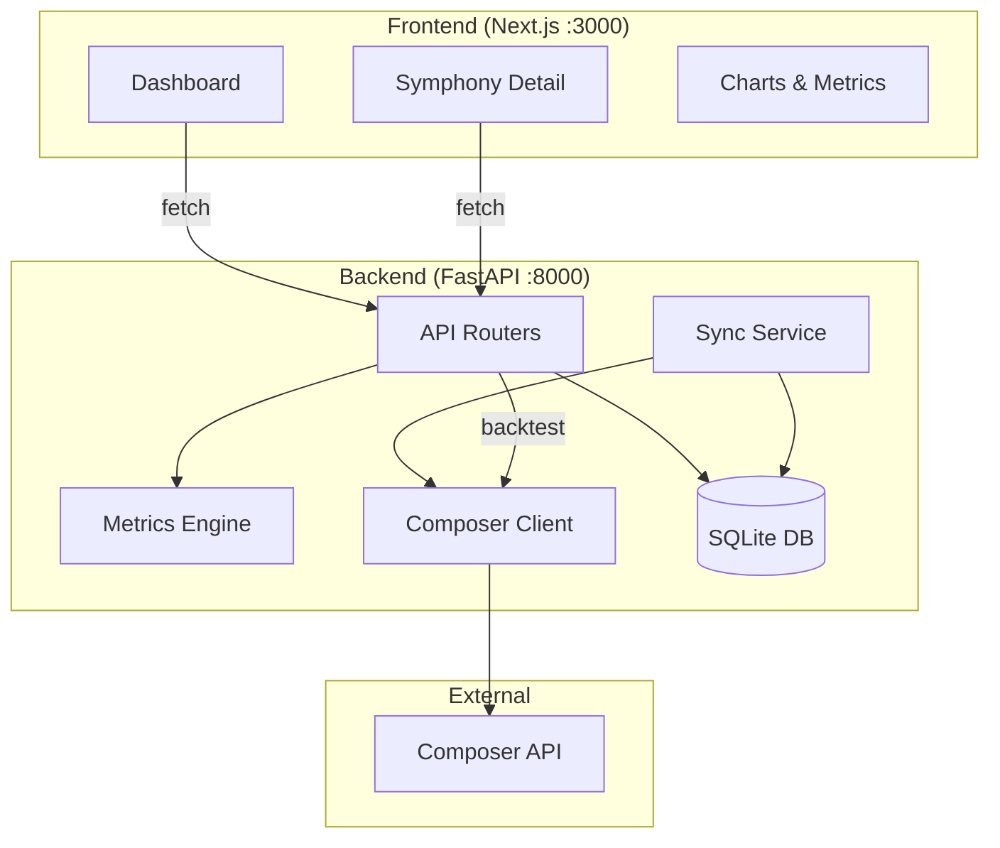
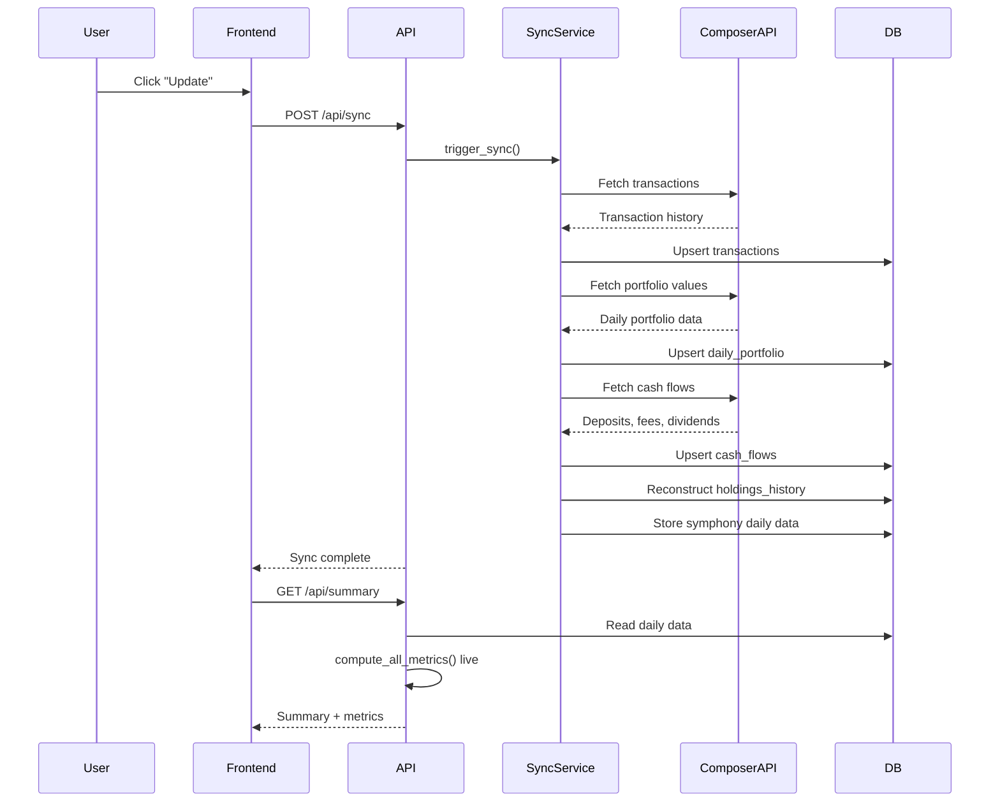
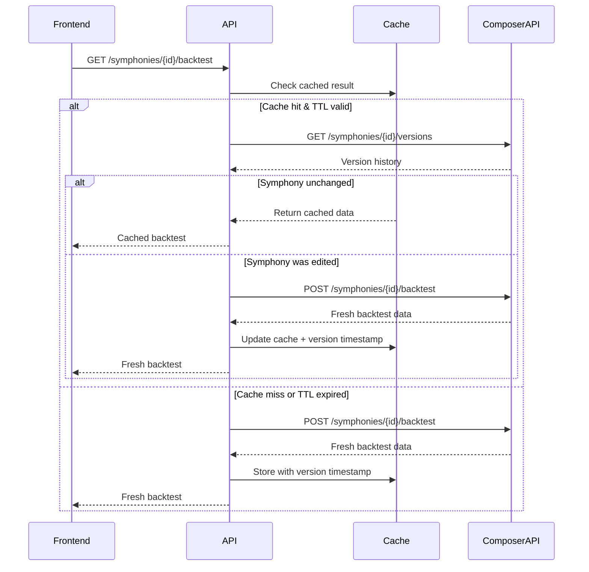
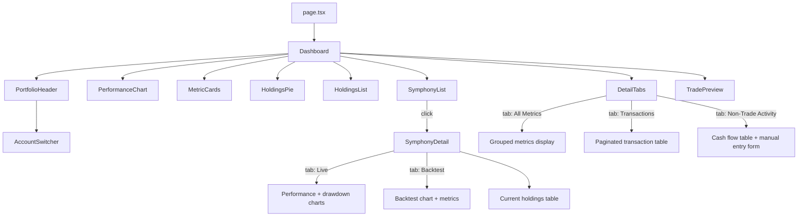

# Architecture

## Tech Stack

| Layer | Technology |
|-------|-----------|
| Backend | Python 3.10+, FastAPI, SQLAlchemy, Pydantic |
| Database | SQLite (file-based, zero config) |
| Frontend | Next.js 14 (App Router), TypeScript, Tailwind CSS, Recharts |
| External API | Composer Trade REST API, Finnhub WebSocket + REST (optional, proxied) |

## High-Level Overview



## Data Flow

### Initial Sync & Incremental Updates



### Live Metrics Computation

Metrics are **computed on the fly** from stored daily portfolio data — not read from pre-computed tables. This ensures consistency across all views.

```mermaid
flowchart LR
    A[daily_portfolio rows] --> B[compute_all_metrics]
    B --> C{Last row}
    C --> D[/api/summary response]
    C --> E[MetricCards display]
    C --> F[All Metrics tab]
```

### Symphony Backtest with Cache Invalidation



## Project Structure

```
composer_portfolio_visualizer/
├── backend/
│   ├── app/
│   │   ├── main.py                # FastAPI app, CORS, lifespan (account discovery)
│   │   ├── config.py              # Settings from config.json loader
│   │   ├── database.py            # SQLAlchemy engine, session, migrations
│   │   ├── models.py              # ORM table definitions
│   │   ├── schemas.py             # Pydantic request/response models
│   │   ├── composer_client.py     # Composer REST API wrapper
│   │   ├── services/
│   │   │   ├── sync.py            # Full backfill + incremental sync logic
│   │   │   ├── metrics.py         # All metric computations (TWR, MWR, Sharpe, etc.)
│   │   │   ├── holdings.py        # Holdings reconstruction from trades
│   │   │   └── symphony_export.py # Symphony structure export (local)
│   │   └── routers/
│   │       ├── portfolio.py       # Portfolio endpoints (summary, performance, holdings, etc.)
│   │       ├── symphonies.py      # Symphony endpoints (list, summary, backtest, allocations)
│   │       └── health.py          # Health check, metrics guide, Finnhub proxy
│   ├── tests/
│   │   ├── test_metrics.py        # 83 metric computation tests
│   │   └── conftest.py            # Shared test fixtures
│   ├── data/                      # SQLite database (auto-created)
│   └── requirements.txt
├── frontend/
│   ├── src/
│   │   ├── app/
│   │   │   ├── page.tsx           # Root page — renders Dashboard
│   │   │   ├── layout.tsx         # App shell, fonts, metadata
│   │   │   └── globals.css        # Tailwind base + dark theme variables
│   │   ├── components/
│   │   │   ├── Dashboard.tsx      # Main layout: header, chart, metrics, tabs
│   │   │   ├── PortfolioHeader.tsx# Portfolio value, sync button, account switcher
│   │   │   ├── AccountSwitcher.tsx# Sub-account dropdown
│   │   │   ├── PerformanceChart.tsx# Recharts area chart with period selector
│   │   │   ├── MetricCards.tsx    # Key metric tiles (return, Sharpe, drawdown, etc.)
│   │   │   ├── DetailTabs.tsx     # All Metrics / Transactions / Non-Trade Activity tabs
│   │   │   ├── HoldingsPie.tsx    # Donut chart of current holdings
│   │   │   ├── HoldingsList.tsx   # Holdings table with history navigation
│   │   │   ├── SymphonyList.tsx   # Symphony cards grid
│   │   │   ├── SymphonyDetail.tsx # Symphony modal: live/backtest charts + metrics
│   │   │   ├── TradePreview.tsx   # Pending rebalance trades
│   │   │   ├── MetricsGuide.tsx   # METRICS.md viewer overlay
│   │   │   ├── SettingsModal.tsx  # Export path + daily snapshot config
│   │   │   ├── SnapshotView.tsx   # Off-screen screenshot render (1200×900, 4:3)
│   │   │   ├── Toast.tsx          # Lightweight toast notifications
│   │   │   └── InfoTooltip.tsx    # Reusable tooltip component
│   │   ├── hooks/
│   │   │   ├── useAutoRefresh.ts  # Auto-refresh during market hours
│   │   │   └── useFinnhubQuotes.ts # Real-time ticker prices via Finnhub WebSocket
│   │   └── lib/
│   │       ├── api.ts             # Backend API client + TypeScript interfaces
│   │       ├── marketHours.ts     # US market hours detection
│   │       └── utils.ts           # Tailwind class merge utility
│   └── package.json
├── docs/
│   ├── ARCHITECTURE.md            # This file
│   └── METRICS.md                 # Detailed metric formulas
├── config.json.example            # Configuration template (credentials + settings)
├── start.py                       # One-command launcher
├── stop.py                        # Graceful shutdown + zombie process cleanup
└── README.md
```

## API Reference

### Portfolio Endpoints

| Method | Endpoint | Description |
|--------|----------|-------------|
| GET | `/api/health` | Health check |
| GET | `/api/config` | Client-safe config (Finnhub availability, export status) |
| POST | `/api/config/symphony-export` | Save symphony export local path |
| POST | `/api/config/screenshot` | Save daily snapshot configuration |
| POST | `/api/screenshot` | Upload PNG screenshot to configured folder |
| GET | `/api/finnhub/quote` | Proxy: fetch Finnhub quotes server-side (comma-separated symbols) |
| WS | `/api/finnhub/ws` | Proxy: WebSocket relay to Finnhub (keeps API key server-side) |
| GET | `/api/metrics-guide` | Serve METRICS.md as plain text |
| GET | `/api/accounts` | List discovered sub-accounts |
| GET | `/api/summary` | Portfolio summary with all latest metrics (computed live) |
| GET | `/api/summary/live` | Summary with today's value replaced by live intraday data |
| GET | `/api/performance` | Performance chart series (filterable by period, date range) |
| GET | `/api/holdings` | Holdings for a specific date (defaults to latest) |
| GET | `/api/holdings-history` | All dates with position counts |
| GET | `/api/transactions` | Paginated transaction history (filterable by symbol) |
| GET | `/api/cash-flows` | All cash flow events (deposits, withdrawals, fees, dividends) |
| POST | `/api/cash-flows/manual` | Add a manual deposit or withdrawal |
| GET | `/api/sync/status` | Current sync state per account |
| POST | `/api/sync` | Trigger full backfill or incremental update |

All portfolio endpoints accept an optional `account_id` query parameter:
- Omit or `all` — aggregate across all accounts
- `all:<credential_name>` — aggregate across one credential's sub-accounts
- Specific UUID — single sub-account

### Symphony Endpoints

| Method | Endpoint | Description |
|--------|----------|-------------|
| GET | `/api/symphonies` | List all symphonies with live stats and current holdings |
| GET | `/api/symphonies/{id}/performance` | Daily performance series for charting |
| GET | `/api/symphonies/{id}/summary` | Period-aware computed metrics |
| GET | `/api/symphonies/{id}/summary/live` | Summary with live intraday value overlay |
| GET | `/api/symphonies/{id}/backtest` | Backtest results (cached, version-check invalidation) |
| GET | `/api/symphonies/{id}/allocations` | Historical allocation snapshots |
| GET | `/api/symphony-benchmark/{id}` | Backtest a symphony and return BenchmarkPoint[] for chart overlay |
| GET | `/api/symphony-catalog` | Cached symphony name catalog for search (`?refresh=true` to force) |
| GET | `/api/trade-preview` | Pending rebalance trades across all symphonies |
| GET | `/api/symphonies/{id}/trade-preview` | Pending trades for one symphony |

### Benchmark Endpoints

| Method | Endpoint | Description |
|--------|----------|-------------|
| GET | `/api/benchmark-history` | Ticker benchmark (Stooq historical + Finnhub live quote): TWR, drawdown, MWR series |
| GET | `/api/symphony-benchmark/{id}` | Symphony benchmark: backtest → BenchmarkPoint[] format |

## Database Schema

```mermaid
erDiagram
    accounts {
        text id PK "Composer account UUID"
        text credential_name "Label from config.json"
        text account_type "INDIVIDUAL, IRA_ROTH, etc."
        text display_name "Friendly name"
        text status
    }

    transactions {
        int id PK
        text account_id FK
        date date
        text symbol
        text action "buy / sell"
        float quantity
        float price
        float total_amount
        text order_id UK "unique per account"
    }

    holdings_history {
        int id PK
        text account_id FK
        date date
        text symbol
        float quantity
    }

    cash_flows {
        int id PK
        text account_id FK
        date date
        text type "deposit / withdrawal / fee_cat / dividend"
        float amount "signed"
        text description
    }

    daily_portfolio {
        text account_id PK
        date date PK
        float portfolio_value
        float cash_balance
        float net_deposits
        float total_fees
        float total_dividends
    }

    daily_metrics {
        text account_id PK
        date date PK
        float daily_return_pct
        float cumulative_return_pct
        float time_weighted_return
        float sharpe_ratio
        float sortino_ratio
        float max_drawdown
        float annualized_volatility
    }

    benchmark_data {
        date date PK
        text symbol "default: SPY"
        float close
    }

    symphony_daily_portfolio {
        text account_id PK
        text symphony_id PK
        date date PK
        float portfolio_value
        float net_deposits
    }

    symphony_backtest_cache {
        text symphony_id PK
        text account_id
        datetime cached_at
        text stats_json
        text dvm_capital_json
        text summary_metrics_json
        text last_semantic_update_at "version tracking"
    }

    symphony_allocation_history {
        int id PK
        text account_id
        text symphony_id
        date date
        text ticker
        float allocation_pct
        float value
    }

    sync_state {
        text account_id PK
        text key PK "e.g. last_sync_date"
        text value
    }

    accounts ||--o{ transactions : has
    accounts ||--o{ holdings_history : has
    accounts ||--o{ cash_flows : has
    accounts ||--o{ daily_portfolio : has
    accounts ||--o{ daily_metrics : has
    symphony_catalog {
        text symphony_id PK
        text name
        text source "invested / watchlist / draft"
        text credential_name
        datetime updated_at
    }

    accounts ||--o{ symphony_daily_portfolio : has
    accounts ||--o{ symphony_allocation_history : has
    accounts ||--o{ sync_state : has
```



## Frontend Component Tree



## Key Design Decisions

### Live Metric Computation

Metrics displayed on the dashboard are **not** read from the `daily_metrics` table. Instead, `/api/summary` aggregates raw `daily_portfolio` rows and calls `compute_all_metrics()` on the fly. This guarantees that MetricCards, the All Metrics tab, and symphony summaries always show consistent, up-to-date values.

### Dual Annualized Return

Two annualized return calculations are maintained:

- **`annualized_return`** — TWR-based (time-weighted, deposit-immune)
- **`annualized_return_cum`** — cumulative-return-based (simple, intuitive)

The dashboard displays the cumulative-based variant as "Annualized Return" since it's more intuitive for end users. TWR is shown separately. The Calmar ratio uses the cumulative-based variant.

### Benchmark Overlay

All chart views (Dashboard, SymphonyDetail live + backtest) support a benchmark overlay:

- **Predefined tickers**: SPY, QQQ, TQQQ via Stooq historical candles; today's point uses Finnhub quote (`/api/benchmark-history`)
- **Custom tickers**: Any valid ticker symbol via the `+` input
- **Symphony name search**: Type 2+ characters to search the symphony catalog by name. The catalog is cached in `symphony_catalog` (SQLite) and auto-refreshes every hour or on sync. Currently populated from invested symphonies (`symphony-stats-meta`). Watchlist/draft endpoints (`backtest-api.composer.trade`) require web session auth and are not accessible via API keys.
- **Symphony backtests**: Paste a Composer symphony URL (e.g. `https://app.composer.trade/symphony/{id}/details`) or raw ID. The frontend detects `composer.trade/symphony/` URLs and routes to `/api/symphony-benchmark/{id}`.

Split-event source for holdings reconstruction:
- Primary: Finnhub `/stock/split` (if plan permits)
- Fallback: Polygon `/v3/reference/splits` when `polygon_api_key` is configured

Symphony benchmark fetching loops through all credential sets to find private symphonies across accounts. The symphony name (clamped to 21 characters) is displayed as the label. Benchmark return data is rebased to start at 0% from the chart's first visible date using growth-factor division.

### Backtest Slippage & Spread

Our backtest parameters use more conservative friction than Composer's defaults:

| Parameter | This App | Composer Default |
|-----------|----------|------------------|
| `slippage_percent` | 0.0005 (5 bps) | 0.0001 (1 bps) |
| `spread_markup` | 0.001 (10 bps) | 0 |
| **Total per-trade friction** | **15 bps** | **1 bps** |

This means backtest results from this app will be **slightly lower** than Composer's UI for the same period (typically 3–5 percentage points over several months for active strategies). The higher friction better approximates real-world execution costs including bid-ask spreads and market impact.

### Backtest Cache Strategy

Symphony backtests are relatively more expensive API calls. The caching strategy uses two layers:

1. **TTL** — cache expires after 24 hours regardless
2. **Version check** — on cache hit, a lightweight call to `/symphonies/{id}/versions` checks if the symphony was edited since the cache was built. If so, the cache is invalidated and a fresh backtest is fetched.

The `last_semantic_update_at` timestamp from the version history is stored alongside the cached data for comparison.

### Multi-Account Aggregation

All portfolio endpoints support three modes via the `account_id` query parameter:

- **Single account** — pass a specific UUID
- **Credential group** — `all:<name>` aggregates all sub-accounts under one credential set
- **Global** — omit or pass `all` to aggregate everything

Aggregation sums `portfolio_value` and `net_deposits` across accounts per day, then computes metrics on the combined series.

### Data Sync & Update Strategy

The application does **not** run a background scheduler or cron job. All syncs are triggered reactively:

1. **Manual sync** — User clicks **Update** in the UI → `POST /api/sync` → runs `incremental_update()` (or `full_backfill()` on first run).
2. **Automatic post-close sync** — The frontend runs a once-per-day check after market close (4:00 PM ET). On mount and every 60 seconds, it checks `isAfterClose()` and a `localStorage` flag (`last_post_close_update`). If the market has closed today and no sync has run yet, it auto-triggers `POST /api/sync` + data refresh. The flag prevents duplicate syncs if the page stays open.
3. **Gap recovery** — If the app hasn't run for multiple days, `incremental_update()` fetches the full portfolio-history from the Composer API (which returns the complete daily series), so all missing portfolio days are backfilled automatically on the next sync. Note: per-symphony daily values (`_sync_symphony_daily_incremental`) only capture today's value, so symphony-level charts may have gaps for days the app wasn't running.

This design means the app works correctly whether it runs continuously or is only opened occasionally — no portfolio data is lost from downtime.

### Real-Time Ticker Quotes

Live price changes per holding are streamed via a Finnhub WebSocket connection, **proxied through the backend** so the API key never reaches the browser:

1. On mount, the frontend checks `GET /api/config` for `finnhub_configured: true` (the actual key is never sent).
2. The `useFinnhubQuotes` hook fetches `previousClose` for each holding symbol via the backend proxy `GET /api/finnhub/quote?symbols=...`.
3. A WebSocket connection to `ws://localhost:8000/api/finnhub/ws` subscribes to all holding symbols. The backend relays messages to/from `wss://ws.finnhub.io` with the API key attached server-side.
4. Each trade update computes `change = price - previousClose` and `changePct = change / previousClose * 100`.
5. The `HoldingsList` component displays badges like `+$1.23 (+0.5%)` next to each ticker.

The WebSocket stays connected on weekdays from 9:30 AM through midnight ET (regular + extended hours). It auto-reconnects with exponential backoff (max 30s). If no Finnhub key is configured, the feature is silently disabled.

### Symphony Structure Export

Symphony definitions (logic trees) are automatically exported as JSON files:

1. During each **daily sync** (`full_backfill` / `incremental_update`), `export_all_symphonies()` runs as a sync step. It calls `GET /api/v0.1/symphonies/{id}/versions` for each symphony and compares the latest version's `created_at` against a stored timestamp in `sync_state`. Only new/changed versions are saved.
2. When the **backtest endpoint** detects a stale cache (symphony edited since last backtest), it triggers `export_single_symphony()` for immediate export of the changed symphony.

Files are saved locally as `<SymphonyName>/<SymphonyName>_<YYYY-MM-DD>.json`. The local export path is configured via the frontend Settings modal (`POST /api/config/symphony-export`) and persisted in `config.json`.

### Daily Snapshot

A configurable screenshot feature that captures a clean portfolio snapshot image:

1. **Automatic**: After the once-per-day post-close sync (4 PM ET), if enabled in settings, `Dashboard.tsx` renders an off-screen `SnapshotView` component and captures it via `html-to-image`.
2. **Manual**: A camera button in `PortfolioHeader.tsx` triggers the same capture flow on demand.
3. The captured PNG is POSTed to `POST /api/screenshot`, which saves it as `Snapshot_YYYY-MM-DD.png` in the configured folder.

The snapshot layout is a fixed 1200×900px (4:3) dark card with:
- Header (date, optional portfolio value + today's change)
- One full-width chart (TWR / Portfolio Value / MWR / Drawdown — user-configurable)
- Metric cards in a 4-column grid (user selects which metrics to include)

Configuration is stored in `config.json` under the `screenshot` key and managed via the Settings modal's "Daily Snapshot" section. Options include: account, chart type, date range (preset or custom start date), hide portfolio value, and metric selection.

### Schema Migrations

SQLite doesn't support full ALTER TABLE operations. The app uses a lightweight migration system in `database.py` that checks for missing columns on startup and adds them via `ALTER TABLE ADD COLUMN`. New columns are registered in the `_MIGRATIONS` list.
