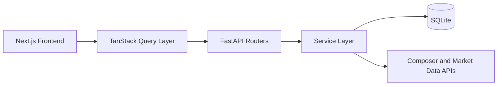
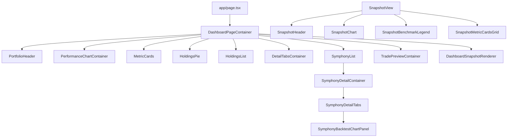

# Architecture

## Purpose

This document describes the current implementation architecture for Portfolio Dashboard after the refactor and naming migration.

## Tech Stack

| Layer | Technology |
|---|---|
| Backend | Python, FastAPI, SQLAlchemy, Pydantic |
| Database | SQLite |
| Frontend | Next.js App Router, TypeScript, Tailwind CSS, Recharts, TanStack Query |
| Test | Pytest, Vitest, Playwright |
| External APIs | Composer API, Finnhub, Stooq, optional Polygon |

## Architectural Priorities

1. Keep backend routers thin and move business orchestration to services.
2. Keep frontend feature orchestration in `frontend/src/features/*`.
3. Keep shared chart contracts and math in `frontend/src/features/charting/*`.
4. Preserve public API route paths and payload compatibility unless explicitly changed.
5. Use script-orchestrated integration tests for reliable E2E execution.

## High-Level Data Flow



## Backend Boundaries

### Router layer

`backend/app/routers/*` responsibilities:
- parse HTTP inputs
- call service functions
- return schema-backed responses

No heavy aggregation or mutation orchestration should stay in routers.

### Service layer

`backend/app/services/*` responsibilities:
- account/date scope resolution
- portfolio and symphony reads
- sync orchestration and caching
- benchmark data handling
- admin and config flows

Notable service modules:
- `account_scope.py`, `date_filters.py`
- `portfolio_read.py`, `portfolio_live_overlay.py`, `portfolio_holdings_read.py`, `portfolio_activity_read.py`
- `symphony_read.py`, `symphony_list_read.py`, `symphony_benchmark_read.py`, `symphony_trade_preview.py`
- `benchmark_read.py`, `backtest_cache.py`
- `portfolio_admin.py`
- `sync.py`

### Schemas

Request and response models are centralized in `backend/app/schemas.py`.

## Frontend Boundaries

### Feature modules

`frontend/src/features/*` owns orchestration:
- `dashboard/*`
- `symphony-detail/*`
- `trade-preview/*`
- `settings/*`
- `charting/*`

### Shared and compatibility components

`frontend/src/components/*` is used for:
- shared presentational components
- compatibility re-export paths

### Charting contract ownership

`frontend/src/features/charting/*` is the single source of truth for:
- chart data contracts and adapter shape
- benchmark rebasing and drawdown calculations
- shared tooltip and control behavior

### TanStack Query server-state layer

`frontend/src/lib/*` query contracts:
- `queryKeys.ts`: stable key factories for all server-state families
- `queryFns.ts`: shared API-backed query functions and endpoint retry overrides
- `queryInvalidation.ts`: centralized invalidation families for sync, cash-flow, and config writes

Provider wiring:
- `frontend/src/app/providers.tsx`
- `frontend/src/lib/queryClient.ts`
- `frontend/src/app/layout.tsx`

Default query policy:
- `refetchOnWindowFocus: false`
- `refetchOnReconnect: true`
- `gcTime: 600000`
- `retry: 1` default
- `retry: 0` overrides for `symphonyBacktest` and `symphonyBenchmark`

## Project Structure

```text
portfolio_dashboard/
- backend/
  - app/
    - main.py
    - config.py
    - database.py
    - models.py
    - schemas.py
    - routers/
      - portfolio.py
      - symphonies.py
      - health.py
    - services/
      - account_scope.py
      - date_filters.py
      - portfolio_admin.py
      - portfolio_read.py
      - symphony_read.py
      - benchmark_read.py
      - backtest_cache.py
      - sync.py
      - ...
  - tests/
    - contracts/
      - test_portfolio_api_contract.py
      - test_symphonies_api_contract.py
      - test_benchmark_api_contract.py
    - test_account_scope.py
    - test_date_range_resolution.py
    - test_metrics.py
- frontend/
  - src/
    - app/
      - page.tsx
      - layout.tsx
      - providers.tsx
    - components/
      - Dashboard.tsx
      - PerformanceChart.tsx
      - SymphonyDetail.tsx
      - DetailTabs.tsx
      - TradePreview.tsx
      - SettingsModal.tsx
      - SnapshotView.tsx
      - ...
    - features/
      - dashboard/
      - symphony-detail/
      - trade-preview/
      - settings/
      - charting/
    - lib/
      - api.ts
      - marketHours.ts
      - queryClient.ts
      - queryKeys.ts
      - queryFns.ts
      - queryInvalidation.ts
- scripts/
  - run-local-tests.ps1
- docs/
  - ARCHITECTURE.md
  - METRICS.md
  - TESTING.md
  - TEST_MATRIX.md
  - OPERATIONS_RUNBOOK.md
  - CONTRIBUTING.md
  - TQ1_TANSTACK_QUERY_BLUEPRINT.md
- AGENTS.md
- README.md
- start.py
- stop.py
```

## Frontend Component Topology



## API Surface (Stable Contracts)

### Portfolio routes

- `GET /api/accounts`
- `GET /api/summary`
- `GET /api/summary/live`
- `GET /api/performance`
- `GET /api/holdings`
- `GET /api/holdings-history`
- `GET /api/transactions`
- `GET /api/cash-flows`
- `POST /api/cash-flows/manual`
- `GET /api/sync/status`
- `POST /api/sync`
- `GET /api/config`
- `POST /api/config/symphony-export`
- `POST /api/config/screenshot`
- `POST /api/screenshot`
- `GET /api/benchmark-history`

### Symphony routes

- `GET /api/symphonies`
- `GET /api/symphony-catalog`
- `GET /api/symphonies/{symphony_id}/performance`
- `GET /api/symphonies/{symphony_id}/summary`
- `GET /api/symphonies/{symphony_id}/summary/live`
- `GET /api/symphonies/{symphony_id}/backtest`
- `GET /api/symphonies/{symphony_id}/allocations`
- `GET /api/trade-preview`
- `GET /api/symphonies/{symphony_id}/trade-preview`
- `GET /api/symphony-benchmark/{symphony_id}`

## Account Scope Rules

The optional `account_id` query parameter supports:
- specific sub-account UUID
- `all`
- `all:<credential_name>`

Test mode visibility rules are enforced by shared account-scope logic.

## Test and Validation Strategy

Contract and seam tests:
- `backend/tests/contracts/*`
- `backend/tests/test_account_scope.py`
- `backend/tests/test_date_range_resolution.py`

Primary execution gates:
- `python -m pytest backend/tests -q`
- `cd frontend && npm run lint`
- `powershell -ExecutionPolicy Bypass -File scripts/run-local-tests.ps1 -Profile basic`
- `powershell -ExecutionPolicy Bypass -File scripts/run-local-tests.ps1 -Profile power`
- `powershell -ExecutionPolicy Bypass -File scripts/run-local-tests.ps1 -Visual`

See `docs/TEST_MATRIX.md` for scope-to-gate mapping.

## Environment Variable Migration

Preferred:
- `PD_TEST_MODE`
- `PD_DATABASE_URL`

Legacy temporary aliases:
- `CPV_TEST_MODE`
- `CPV_DATABASE_URL`

Resolution rules:
- If both are set, `PD_*` wins.
- Using only `CPV_*` logs a deprecation warning.
- Removal target: next major refactor cycle after TQ-1.

## TQ-1 Status

TQ-1 migration is now implemented for frontend server-state. Follow-up refinements remain tracked in:
- `docs/TQ1_TANSTACK_QUERY_BLUEPRINT.md`

Future server-state work should extend the existing query key/fn/invalidation contracts rather than adding parallel cache orchestration patterns.
